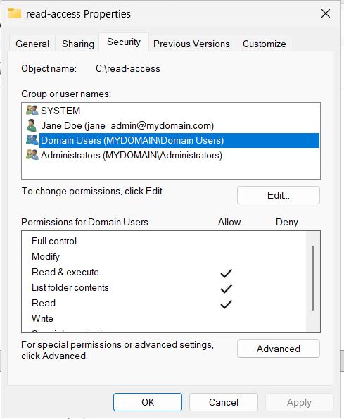
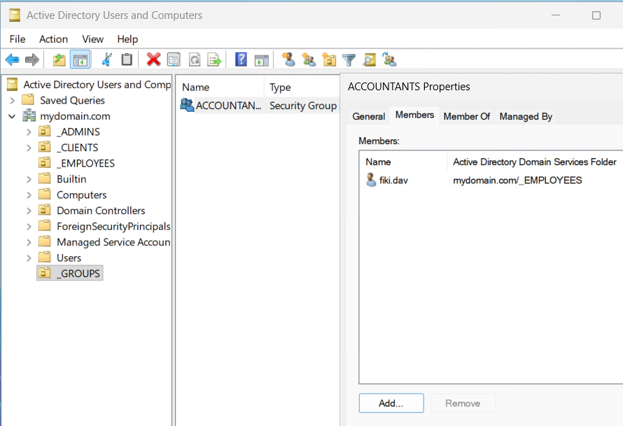
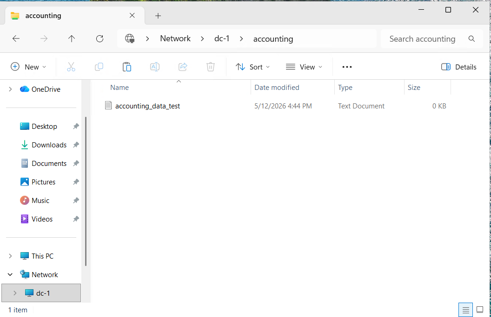

# Azure Active Directory: File Server Management & Security Groups Lab

---

## Introduction
This lab focuses on the implementation of **Network File Sharing** and **Role-Based Access Control (RBAC)** within a Windows-based enterprise environment. By configuring Shared Folder permissions and Active Directory Security Groups, this project demonstrates how to enforce the **Principle of Least Privilege (PoLP)**. Key objectives include managing NTFS and Share permissions, creating targeted security groups for departmental isolation (e.g., Accounting), and validating the impact of group membership changes on end-user access within an Azure-hosted domain.

---

## Technical Skills & Tools

* **Windows Server 2022:** Administering Shared Folders and NTFS permissions via File Explorer and Server Manager.
* **Active Directory Users and Computers (ADUC):** Provisioning Security Groups and managing user object memberships.
* **Access Control Management:** Implementing Role-Based Access Control (RBAC) to enforce data silos between departments.
* **Network Resource Discovery:** Utilizing the Universal Naming Convention (UNC) pathing (`\\DC-1\`) to map and test network shares.
* **Microsoft Azure:** Orchestrating communication between a Domain Controller (DC-1) and a Windows Client (Client-1) within a cloud-native Virtual Network.
---

## Part 1: Shared Resource Provisioning & Access Control
The first phase focused on establishing the infrastructure for network file sharing and defining the baseline security posture for various organizational folders. This demonstrates the practical application of NTFS and Share permissions to control data visibility.
* **Directory Creation:** Established a set of functional folders on the Domain Controller (DC-1) to simulate various access scenarios, including restricted, open-read, and departmental repositories.
* **Permission Mapping:** Configured specific access levels for "Domain Users" and "Domain Admins." This included verifying that users could read data in "read-access" but were restricted from making modifications, enforcing data integrity.
* **Infrastructure Verification:** Confirmed that the Domain Controller was successfully broadcasting these shares over the internal virtual network, making them discoverable via the Universal Naming Convention (UNC) path.

  

---

## Part 2: Security Group Implementation & Departmental Isolation
The final phase demonstrated the power of **Role-Based Access Control (RBAC)** by creating a specific security group to manage departmental data access. This simulates the transition from generic "Domain User" access to restricted, job-specific permissions.
* **Security Group Provisioning:** Created the "ACCOUNTANTS" Security Group within Active Directory. This allows for administrative scalability, as permissions are managed at the group level rather than per individual user.
* **Membership Validation:** Conducted a "before-and-after" access test. Initially, the test user was denied access to the "accounting" share. After adding the user to the "ACCOUNTANTS" group on DC-1 and re-authenticating, access was successfully granted.
* **Access Auditing:** Verified that the user could now read and write to the departmental folder, confirming that the new security tokens were correctly issued by the Domain Controller upon the new login session.

  

---

## Part 3: Infrastructure Validation & User Experience
The final stage involved verifying the impact of administrative changes on the end-user experience. This phase proved that the security tokens were correctly issued and recognized by the network.
* **Access Grant Verification:** After adding the test user to the "ACCOUNTANTS" group, a final login session was initiated to refresh the user's security token.
* **End-to-End Connectivity:** Successfully navigated to `\\DC-1\accounting` from Client-1. The workstation confirmed full Read/Write access, validating that the Active Directory backend and the Windows Client were in perfect synchronization.
* **Security Silo Confirmation:** Conducted a final audit to ensure that while the "accounting" folder was accessible to the authorized user, it remained restricted to others, maintaining strict departmental isolation.

  

---

## Project Outcome & Key Takeaways
The lab successfully established a secure, role-based file sharing environment within an Azure-hosted Active Directory forest. By implementing Security Groups and granular NTFS/Share permissions, the project demonstrated how to effectively manage organizational data, ensuring that users have access only to the resources necessary for their specific roles.

### Core Technical Competencies
* **Role-Based Access Control (RBAC):** Implementing the "Principle of Least Privilege" by utilizing Active Directory Security Groups to manage folder permissions.
* **File System Security:** Managing the intersection of Share permissions and NTFS permissions to ensure a secure and functional user experience.
* **Identity Management:** Provisioning and auditing user group memberships within Active Directory Users and Computers (ADUC).
* **Network Resource Mapping:** Troubleshooting and validating Universal Naming Convention (UNC) paths and resource discovery across a cloud-based Virtual Network.

### Key Takeaways
* **Permission Inheritance:** Gained a practical understanding of how permission inheritance works and how to override it for sensitive departmental folders (e.g., Accounting).
* **Group Policy Logic:** Observed that group membership changes require a fresh login token to take effect, a critical realization for real-world IT support and troubleshooting.
* **Administrative Scalability:** Validated that managing permissions via Security Groups is far more efficient and less error-prone than assigning permissions to individual user accounts.
* **Data Siloing:** Successfully simulated a corporate environment where departmental data is isolated, protecting sensitive information from unauthorized internal access.

---

## Conclusion & Cleanup
To maintain cost-efficiency and security hygiene, the DC-1 and Client-1 virtual machines were decommissioned upon the successful validation of the access control policies. This lab serves as a foundational exercise in managing enterprise-level data security and identity services in a cloud environment.
